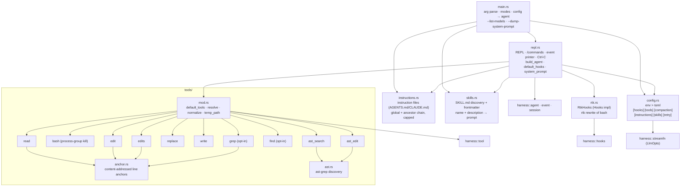

# wcode Dependency Graph

Map for exploring the codebase. Two crates, strict one-way layering.

```
crates/wcode-cli   (bin `wcode`)        the application: config, REPL, built-in tools
       │
       ▼
crates/wcode-harness (lib)              the kernel: loop, tools, hooks, events, session
       │
       ▼
rig 0.42                                LLM engine: streaming + tool-schema plumbing
                                        (touched ONLY by wcode-harness/src/streamfn.rs)
```

## Crate: `wcode-harness` (module level)

```mermaid
graph TD
    message["message.rs<br/>AgentMessage, ContentBlock,<br/>StopReason, Usage"]
    event["event.rs<br/>AgentEvent (wire/UI),<br/>LlmStreamEvent (seam)"]
    tool["tool.rs<br/>TypedTool trait, erased Tool,<br/>ToolContext, ToolOutput"]
    hooks["hooks.rs<br/>Hooks trait (default no-ops)"]
    session["session.rs<br/>Session (JSONL append-only)"]
    streamfn["streamfn.rs<br/>StreamFn seam + rig adapter<br/>(LlmOpts, rig_stream_fn, retry)"]
    compaction["compaction.rs<br/>CompactionPolicy, cut, summarize"]
    limits["limits.rs<br/>model context windows"]
    loop_["loop_.rs<br/>run_loop() — the kernel"]
    agent["agent.rs<br/>Agent — stateful wrapper<br/>(queues, cancel, session)"]

    event --> message
    tool --> event
    hooks --> message
    hooks --> tool
    session --> message
    streamfn --> message
    streamfn --> event
    loop_ --> message
    loop_ --> event
    loop_ --> tool
    loop_ --> hooks
    loop_ --> streamfn
    loop_ --> compaction
    agent --> loop_
    agent --> agent_msg[message]
    agent --> event
    agent --> tool
    agent --> hooks
    agent --> session
    agent --> streamfn
    agent --> compaction

    compaction --> message
    compaction --> limits

    streamfn -.->|rig types<br/>only here| rig((rig))
    tool -.->|rig::completion::ToolDefinition<br/>in definition()| rig
```

Reading order for a new contributor:

1. `message.rs` — data model, serde shapes are contractual (session format)
2. `event.rs` — what the kernel emits (`AgentEvent`) and what providers yield (`LlmStreamEvent`)
3. `tool.rs` — how a tool is written (`TypedTool` + erasure) and what the loop calls
4. `loop_.rs` — the turn loop: steer drain → transform_context → stream → tool exec → follow-ups
5. `agent.rs` — channels/cancel/session wiring around the loop
6. `session.rs`, `hooks.rs`, `streamfn.rs` — persistence, extension points, rig adapter
7. `compaction.rs`, `limits.rs` — context budget, cut points, summarization, model windows

## Crate: `wcode-cli` (module level)



### Config & tool gating

`~/.config/wcode/config.toml` (env beats toml): `model` (required), `base_url`,
`api_key`, `endpoint`, `effort`, plus these tables:

- `[hooks] rtk = auto|true|false` — `rtk.rs` wraps `bash` commands through the
  `rtk rewrite` proxy (auto = on only if the `rtk` binary is on PATH).
- `[tools] grep / find = true|false` — off by default (bash can search/glob).
- `[compaction]` — budget/window/keep-recent knobs for context compaction.
- `[retry]` — connect/first-item retry policy (max/base_ms/cap_ms).
- `[instructions] file/names/global` — instruction ("reference") files: a global
  file plus the ancestor chain, folded into the system prompt (`instructions.rs`).
- `[skills] enabled/dirs/disabled` — `SKILL.md` discovery; only name+description
  enter the prompt, the body loads on demand via `read` (`skills.rs`).
- `--no-instructions` / `--no-skills` disable discovery; `--dump-system-prompt`
  prints the composed prompt and exits (no model needed).

`default_tools()` registers the six core tools (`read`, `bash`, `edit`, `edits`,
`replace`, `write`) sharing one mutation lock, adds `grep`/`find` only when
enabled, and auto-registers `ast_search`/`ast_edit` only when an `ast-grep`/`sg`
binary is on PATH. `build_agent()` takes an `AgentSpec` (llm, hooks, tools,
compaction, instructions, skills) plus session/context and assembles the
`Agent`: `system_prompt(tools, instructions, skills, cwd)` + `default_tools()` +
`rig_stream_fn()` + `default_hooks()` (the rtk hook) + session + working dir.
the registered inspect tools) + `default_tools()` + `rig_stream_fn()` +
`default_hooks()` (the rtk hook) + session + working dir.

## Kernel data flow (one run)

```
user text ──▶ Agent.run()
              │  pushes User msg (+session append)
              ▼
          run_loop(ctx, LoopConfig, sink)──────────────┐
              │                                        │ events
              │ steering drain → transform_context     ▼
              ▼                                  AgentEvent channel
     StreamFn(ctx, system, tool_defs, opts)            │
              │  rig: CompletionModel::stream          ▼
              ▼                                  REPL printer (CLI)
     LlmStreamEvent* ──▶ partial Assistant ──▶ MessageUpdate
              │
      tool calls? ──▶ before_tool_call hook
              │        ▶ Tool.execute(args, ToolContext{cancel, events})
              │        ▶ after_tool_call hook (patch)
              ▼
      ToolResult msg ──▶ next turn (inner loop)
              │
      no calls / should_stop ──▶ outer loop: follow_ups? else AgentEnd
```

## External dependencies

| Crate | Used by | For |
|---|---|---|
| `rig` 0.42 (`default-features = false`, `reqwest`, `rustls`) | harness | OpenAI Completions streaming client, `ToolDefinition`, `StreamedAssistantContent` / `StreamFinal` — `streamfn.rs` branches `LlmEndpoint::Chat` (completions client) vs `Responses` (default client) around one shared forwarding loop |
| `tokio` | both | runtime, process (bash), channels |
| `tokio-util` | harness, repl | `CancellationToken` |
| `async-trait` | harness | dyn-safe `TypedTool` / `Hooks` |
| `schemars` 1 | both | JSON Schema for tool args |
| `serde` / `serde_json` | both | message / session / event shapes |
| `futures` | both | streams |
| `uuid`, `chrono` | harness | session ids, timestamps |
| `thiserror` | harness | `LoopError` |
| `regex` | cli | `grep` pattern matching |
| `walkdir` | cli | `grep` / `find` directory walk |
| `globset` | cli | `grep` / `find` include/exclude globs |
| `libc` | cli | `bash` process-group kill (unix) |
| `toml`, `dirs` | cli | config parsing; `~/.config` / `~/.local/share` paths |
| `serde_yaml_ng` | cli | `SKILL.md` frontmatter (the maintained `serde_yaml` fork; pulls `unsafe-libyaml`) |

## Extension points

| Want to… | Do this |
|---|---|
| Add a tool | `impl TypedTool` (Args: `Deserialize + JsonSchema`) + `erased()`; see `crates/wcode-cli/src/tools/read.rs` |
| Change behavior (block/patch tools, rewrite context, early stop) | `impl Hooks` (all default no-ops); see `crates/wcode-harness/src/hooks.rs` |
| Add an LLM provider / wire family | write a `StreamFn` (adapter from provider stream → `LlmStreamEvent`); default is `rig_stream_fn()` in `streamfn.rs` |
| Build a different UI | consume `AgentEvent` from the sink channel; REPL's printer (`repl.rs`) is the reference |
| Change persistence | `Session` in `session.rs` — append-only JSONL, one entry per line |

Constraint worth knowing: rig types live only in `streamfn.rs` (exception: `Tool::definition()` returns rig's `ToolDefinition`) — kernel types never expose rig, so the engine stays swappable via the `StreamFn` seam.
